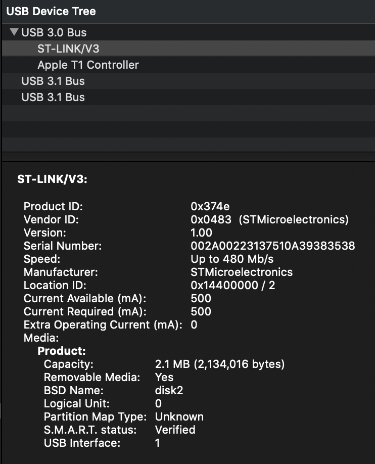
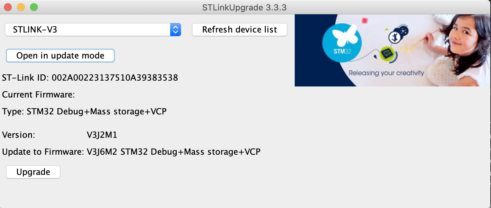
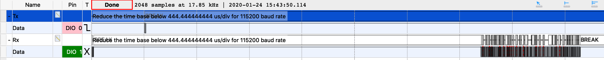
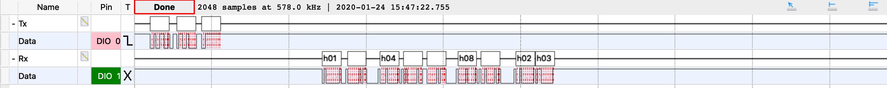

This is an example of a uart based project on a stm32h743.

I created this project to investigate why why +256 bytes using uart hal is not read correctly.
I found that the reason is because stlink-v3 version V3J2M1 has problem handling 256 bytes being sent out.
This was fixed when updated to V3J6M2.

```
VCPPORT=/dev/tty.usbmodem14403
# Load and run test on micro
make swd

# Turn on swo viewer
./swo_parser.py

# Turn on impulse test python script
./stm32_impulse_test.py ${VCPPORT}
```


## Context

I was using a `NUCLEO-H743ZI2` for stm32h743 with silicon revision `Rev V`

### This is the device detail of the stlink



### This is the point where I was upgrading the stlink (which fixed the problem)



Found from: https://www.st.com/content/st_com/en/products/development-tools/software-development-tools/stm32-software-development-tools/stm32-programmers/stsw-link007.html

But make sure to check for newer stsw-linkXXX stlink updater. There may have been further updates since then.

### This is the logic analyser that showed that it's the stlink that's been carking up

* Testing 244 : Ok
   - 
* Testing 256 : No response from device
* Testing 268 : Only few characters received
   - 


--------------------------------------------------------------------------------

# stm32h7 uart test (stlink-v3 ver: V3J6M2) (Problem Fixed)#

## Testing 244 Bytes
 * Tx '244' : Done (HAL_OK)
 * Rx : Done (HAL_OK)
 * Success : Got all 244 bytes
 * Rx :

```
    0 |  01 02 03 04 05 06 07 08 09 01 02 03 04 05 06 07
   16 |  08 09 01 02 03 04 05 06 07 08 09 01 02 03 04 05
   32 |  06 07 08 09 01 02 03 04 05 06 07 08 09 01 02 03
   48 |  04 05 06 07 08 09 01 02 03 04 05 06 07 08 09 01
   64 |  02 03 04 05 06 07 08 09 01 02 03 04 05 06 07 08
   80 |  09 01 02 03 04 05 06 07 08 09 01 02 03 04 05 06
   96 |  07 08 09 01 02 03 04 05 06 07 08 09 01 02 03 04
  112 |  05 06 07 08 09 01 02 03 04 05 06 07 08 09 01 02
  128 |  03 04 05 06 07 08 09 01 02 03 04 05 06 07 08 09
  144 |  01 02 03 04 05 06 07 08 09 01 02 03 04 05 06 07
  160 |  08 09 01 02 03 04 05 06 07 08 09 01 02 03 04 05
  176 |  06 07 08 09 01 02 03 04 05 06 07 08 09 01 02 03
  192 |  04 05 06 07 08 09 01 02 03 04 05 06 07 08 09 01
  208 |  02 03 04 05 06 07 08 09 01 02 03 04 05 06 07 08
  224 |  09 01 02 03 04 05 06 07 08 09 01 02 03 04 05 06
  240 |  07 08 09 01
```

## Testing 256 Bytes
 * Tx '256' : Done (HAL_OK)
 * Rx : Done (HAL_OK)
 * Success : Got all 256 bytes
 * Rx :

```
    0 |  01 02 03 04 05 06 07 08 09 01 02 03 04 05 06 07
   16 |  08 09 01 02 03 04 05 06 07 08 09 01 02 03 04 05
   32 |  06 07 08 09 01 02 03 04 05 06 07 08 09 01 02 03
   48 |  04 05 06 07 08 09 01 02 03 04 05 06 07 08 09 01
   64 |  02 03 04 05 06 07 08 09 01 02 03 04 05 06 07 08
   80 |  09 01 02 03 04 05 06 07 08 09 01 02 03 04 05 06
   96 |  07 08 09 01 02 03 04 05 06 07 08 09 01 02 03 04
  112 |  05 06 07 08 09 01 02 03 04 05 06 07 08 09 01 02
  128 |  03 04 05 06 07 08 09 01 02 03 04 05 06 07 08 09
  144 |  01 02 03 04 05 06 07 08 09 01 02 03 04 05 06 07
  160 |  08 09 01 02 03 04 05 06 07 08 09 01 02 03 04 05
  176 |  06 07 08 09 01 02 03 04 05 06 07 08 09 01 02 03
  192 |  04 05 06 07 08 09 01 02 03 04 05 06 07 08 09 01
  208 |  02 03 04 05 06 07 08 09 01 02 03 04 05 06 07 08
  224 |  09 01 02 03 04 05 06 07 08 09 01 02 03 04 05 06
  240 |  07 08 09 01 02 03 04 05 06 07 08 09 01 02 03 04
```

## Testing 268 Bytes
 * Tx '268' : Done (HAL_OK)
 * Rx : Done (HAL_OK)
 * Success : Got all 268 bytes
 * Rx :

```
    0 |  01 02 03 04 05 06 07 08 09 01 02 03 04 05 06 07
   16 |  08 09 01 02 03 04 05 06 07 08 09 01 02 03 04 05
   32 |  06 07 08 09 01 02 03 04 05 06 07 08 09 01 02 03
   48 |  04 05 06 07 08 09 01 02 03 04 05 06 07 08 09 01
   64 |  02 03 04 05 06 07 08 09 01 02 03 04 05 06 07 08
   80 |  09 01 02 03 04 05 06 07 08 09 01 02 03 04 05 06
   96 |  07 08 09 01 02 03 04 05 06 07 08 09 01 02 03 04
  112 |  05 06 07 08 09 01 02 03 04 05 06 07 08 09 01 02
  128 |  03 04 05 06 07 08 09 01 02 03 04 05 06 07 08 09
  144 |  01 02 03 04 05 06 07 08 09 01 02 03 04 05 06 07
  160 |  08 09 01 02 03 04 05 06 07 08 09 01 02 03 04 05
  176 |  06 07 08 09 01 02 03 04 05 06 07 08 09 01 02 03
  192 |  04 05 06 07 08 09 01 02 03 04 05 06 07 08 09 01
  208 |  02 03 04 05 06 07 08 09 01 02 03 04 05 06 07 08
  224 |  09 01 02 03 04 05 06 07 08 09 01 02 03 04 05 06
  240 |  07 08 09 01 02 03 04 05 06 07 08 09 01 02 03 04
  256 |  05 06 07 08 09 01 02 03 04 05 06 07
```


--------------------------------------------------------------------------------

# stm32h7 uart test (stlink-v3 ver: V3J2M1) (Original Problem) #

## Testing 244 Bytes
 * Tx '244' : Done (HAL_OK)
 * Rx : Done (HAL_OK)
 * Success : Got all 244 bytes
 * Rx :

```
    0 |  01 02 03 04 05 06 07 08 09 01 02 03 04 05 06 07
   16 |  08 09 01 02 03 04 05 06 07 08 09 01 02 03 04 05
   32 |  06 07 08 09 01 02 03 04 05 06 07 08 09 01 02 03
   48 |  04 05 06 07 08 09 01 02 03 04 05 06 07 08 09 01
   64 |  02 03 04 05 06 07 08 09 01 02 03 04 05 06 07 08
   80 |  09 01 02 03 04 05 06 07 08 09 01 02 03 04 05 06
   96 |  07 08 09 01 02 03 04 05 06 07 08 09 01 02 03 04
  112 |  05 06 07 08 09 01 02 03 04 05 06 07 08 09 01 02
  128 |  03 04 05 06 07 08 09 01 02 03 04 05 06 07 08 09
  144 |  01 02 03 04 05 06 07 08 09 01 02 03 04 05 06 07
  160 |  08 09 01 02 03 04 05 06 07 08 09 01 02 03 04 05
  176 |  06 07 08 09 01 02 03 04 05 06 07 08 09 01 02 03
  192 |  04 05 06 07 08 09 01 02 03 04 05 06 07 08 09 01
  208 |  02 03 04 05 06 07 08 09 01 02 03 04 05 06 07 08
  224 |  09 01 02 03 04 05 06 07 08 09 01 02 03 04 05 06
  240 |  07 08 09 01
```

## Testing 256 Bytes
 * Tx '256' : Done (HAL_OK)
 * Rx : Timeout (HAL_OK)
 * Failed : Got only 0 valid bytes out of 256
 * Rx : 0 | All 00 (256 Bytes)

## Testing 268 Bytes
 * Tx '268' : Done (HAL_OK)
 * Rx : Timeout (HAL_OK)
 * Failed : Got only 12 valid bytes out of 268
 * Rx :

```
    0 |  01 02 03 04 05 06 07 08 09 01 02 03 00 00 00 00
   16 |  00 00 00 00 00 00 00 00 00 00 00 00 00 00 00 00
   32 |  00 00 00 00 00 00 00 00 00 00 00 00 00 00 00 00
   48 |  00 00 00 00 00 00 00 00 00 00 00 00 00 00 00 00
   64 |  00 00 00 00 00 00 00 00 00 00 00 00 00 00 00 00
   80 |  00 00 00 00 00 00 00 00 00 00 00 00 00 00 00 00
   96 |  00 00 00 00 00 00 00 00 00 00 00 00 00 00 00 00
  112 |  00 00 00 00 00 00 00 00 00 00 00 00 00 00 00 00
  128 |  00 00 00 00 00 00 00 00 00 00 00 00 00 00 00 00
  144 |  00 00 00 00 00 00 00 00 00 00 00 00 00 00 00 00
  160 |  00 00 00 00 00 00 00 00 00 00 00 00 00 00 00 00
  176 |  00 00 00 00 00 00 00 00 00 00 00 00 00 00 00 00
  192 |  00 00 00 00 00 00 00 00 00 00 00 00 00 00 00 00
  208 |  00 00 00 00 00 00 00 00 00 00 00 00 00 00 00 00
  224 |  00 00 00 00 00 00 00 00 00 00 00 00 00 00 00 00
  240 |  00 00 00 00 00 00 00 00 00 00 00 00 00 00 00 00
  256 |  00 00 00 00 00 00 00 00 00 00 00 00
```


--------------

Forked from stm32h7xx-cubemx-makefile-openocd-gdbgui-example

SWO parser is thanks to Robert Long from https://github.com/robertlong13/SWO-Parser

